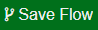
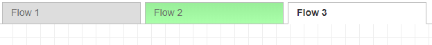

## _Flow Manager_ module for node-red

Flow Manager separates your flow json to multiple files.

### Installation

This assumes you have [Node-RED](https://nodered.org) already installed and working, if you need to install Node-RED see [here](https://nodered.org/docs/getting-started/installation)

**NOTE:** This requires [Node.js](https://nodejs.org) v8.11.1+ and [Node-RED](https://nodered.org/) v0.19+.

Install via Node-RED Manage Palette

```
node-red-contrib-flow-manager
```

Install via npm

```shell
$ cd ~/.node-red
$ npm node-red-contrib-flow-manager
# Restart node-red
```

### Usage 
After installation of this module, during first boot only, your main flow json file will be split to multiple files which will store your node information.
Once that happens, it deletes your main flow json.

Then each node-red boot, during startup,
this module deletes your main flow json file, and instead generates it by combining all of your stored flow json files, and loads that generated file instead.<br/>
For that reason, it is advised to add your "Fat" flow json file to .gitignore because from that moment, the flows are saved separately, and the main file becomes temporary since it is always deleted upon startup.

The nodes will be stored in the following subdirectories of your Node-RED path as such:
* `/flows/`**`flow name`**
* `/subflows/`**`subflow name`**
* `/config-nodes.json` (global config nodes will be stored here)
It's a good idea to add these paths to your version control system. 

    ##### New Buttons:
    
    
    Beside the standard "Deploy" button, 2 new buttons buttons should appear as well after installing this module:
    * Save Flow
    * Filter Flows
    
    #### 
    * Saves only the `flow` you are currently on (the open workspace/tab) and `config nodes`.
    * Automatically "clicks" the standard **Deploy** button.
    
    #### 
    * Allows selecting which flows node-red will load, and which will be ignored and not loaded, **not only in Node-RED's UI, also in it's NodeJS process.** <br/>
    * Unselected flows are NOT deleted, only "ignored" until you select them again using `Filter Flows`.
    * Filtering configuration is stored in `flow_visibility.json` file under your Node-RED path.
    * if `flow_visibility.json` file does not exist, or exists and contains an empty JSON array, all flows are loaded and no filtering is done.
    * 
    
    
#### Known Issues
1. Change Detection:<br>
    #### 
    Modifying any flow or subflow within Node-RED's UI marks unsaved flows and enables the "Save Flow" button so it becomes clickable.<br/>
    However this feature does not always mark your tabs correctly, (e.g clicking Ctrl-Z to revert a modification happened on certain flow while you are working on a different flow)<br/>
    So when that happens, just move any node slightly on the tab you would like to edit, and the "Save Flow" button will become enabled again.
2. After deleting/renaming a flow/subflow via the Node-RED UI, it is required to delete the unwanted flow/subflow file as well.