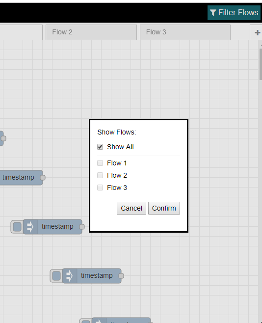

## _Flow Manager_ module for node-red

Flow Manager separates your flow json to multiple files.

### Installation

This assumes you have [Node-RED](https://nodered.org) already installed and working, if you need to install Node-RED see [here](https://nodered.org/docs/getting-started/installation)

**NOTE:** This requires [Node.js](https://nodejs.org) v8.11.1+ and [Node-RED](https://nodered.org/) v0.19+.

Install via Node-RED Manage Palette

```
node-red-contrib-flow-manager
```

Install via npm

```shell
$ cd ~/.node-red
$ npm install node-red-contrib-flow-manager
# Restart node-red
```

### Usage 
After installation of this module, during first boot only, A migration process will initiate.

During migration, your main flow json file will be split to multiple files which will store your node information.<br/>
It is advised to **back up your main flow json**, before running this module for the first time.

Node-RED startup process after migration:<br/>
All of your flow files are combined into a single JSON object, which is then loaded and served as your main flow object.

For that reason, it is advised to add your "fat" flow json file to .gitignore because from that moment, the flows are saved separately.

The nodes will be stored in the following subdirectories of your Node-RED path as such:
* `/flows/`**`flow name`**
* `/subflows/`**`subflow name`**
* `/config-nodes.json` (global config nodes will be stored here)
It's a good idea to add these paths to your version control system. 

####  (Filter Flows Button)
* Allows selecting which flows Node-RED will load, and which will be ignored and not loaded, **not only in Node-RED's UI, also in it's NodeJS process.** <br/>
* Unselected flows are NOT deleted, only "ignored" until you select them again using `Filter Flows`.
* Filtering configuration is stored in `flow_visibility.json` file under your Node-RED path.
* if `flow_visibility.json` file does not exist, or exists but malformed, or contains an empty JSON array, then all flows will be loaded and no filtering is done.
* 
    
### envnodes
envnodes allows configuration of nodes using an external source.<br/>
example:
create "envnodes/default.jsonata" in your Node-RED project directory and put these contents:
```
  (
     $config := require(basePath & "/someConfig.json");
     {
       /* mqtt config node */
       "21bcf36a.891e4d": {
          "broker": $config.mqtt.broker,
          "port": $config.mqtt.port
       }
     };
  )
```
The result would be that your mqtt config node will use values from an external configuration file, which is useful in some cases.

Note `basePath` is the path to your Node-RED directory.<br/>
When using Node-RED's "project mode", the value is the project folder path. 

Attempting to change any envnode controlled property via Node-RED UI/AdminAPI will be cancelled (with a warning popup) to keep original values defined in your envnodes configuration.
    
### YAML flow file format
You can configure flow-manager to load/save flow files in YAML format instead oj JSON, by modifying file `flow_visibility.json` as such:
```
{
  ...
  "fileFormat": "yaml"
  ...
}
```
The advantage is the code within function node becomes easier to read when inspecting the flow file itself.<br/>
See comparison below
* #### YAML
    ```
    - id: 493f0b3.b3b48f4
      type: function
      z: 70dd6be0.e35274
      name: 'SomeFuncNode'
      func: |-
          const str = "hello";
          console.log(str + ' world');
          msg.payload = 'test';
          return msg;
      outputs: 1
      noerr: 0
      x: 580
      'y': 40
      wires:
        - []
    ```
* #### JSON
    ```
    {
        "id": "493f0b3.b3b48f4",
        "type": "function",
        "z": "70dd6be0.e35274",
        "name": "SomeFuncNode",
        "func": "const str = \"hello\";\nconsole.log(str + ' world');\nmsg.payload = 'test';\nreturn msg;",
        "outputs": 1,
        "noerr": 0,
        "x": 580,
        "y": 40,
        "wires": [
            []
        ]
    }
    ```
